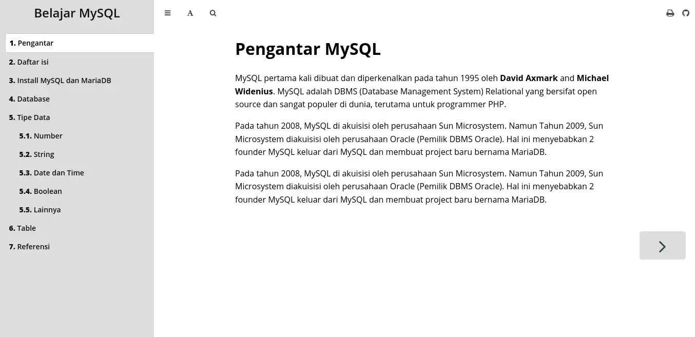
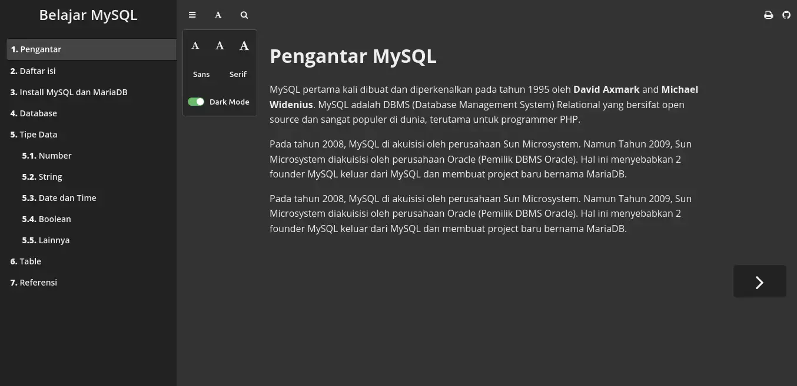

# AzaleaBook - Theme for mdbook


## Preview

| Light | Dark |
| :---: | :--: |
|  |  |

## Usage

- Create a book with the command `mdbook init`.

  ```vim
  mdbook init <directory>
  ```

- Add azaleabook theme 

  ```vim
  cd <directory>
  git submodule add https://github.com/IrvanAhmadP/azaleabook-theme.git azaleabook-theme
  ```

- Config `book.toml`.

  ```toml
  [output.html]
  theme = "azaleabook-theme"
  default-theme = "azaleabook-light"
  preferred-dark-theme = "azaleabook-dark"
  ```
